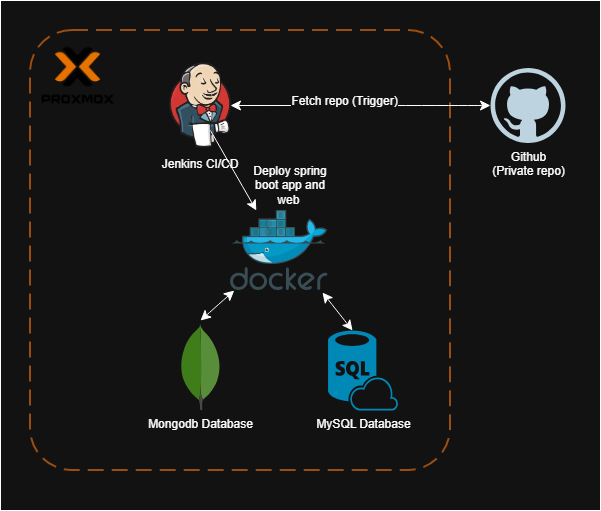

# WebHostingService

WebHostingService is a backend platform built with **Spring Boot 3** and **Java 17** that provides secure web hosting management features.  
It includes **JWT-based authentication**, **MySQL integration**, **Docker deployment**, and a **Jenkins CI/CD pipeline** for automated builds and deployments.

🎥 **Demo Video:**
[▶️ Watch the project in action](https://drive.google.com/file/d/1_V6RgW7OrS9Q2TZXgUxGe9qnYC68aZoW/view?usp=sharing)

---

## Features

- JWT authentication with login and registration endpoints  
- User and role management with Spring Security  
- RESTful API structure following standard HTTP methods  
- MySQL database integration using Spring Data JPA  
- Docker support for containerized deployment  
- Jenkins pipeline for continuous integration and delivery  
- Environment-based configuration using system variables  

---

## Exposed Endpoints and Access Control

| Method | Endpoint | Description | Access |
|--------|-----------|--------------|--------|
| **POST** | `/auth/user/signup` | Register a new standard user account | Public |
| **POST** | `/auth/user/login` | Authenticate a user and issue a JWT | Public |
| **POST** | `/auth/admin/login` | Authenticate an admin and issue a JWT | Public (admin credentials required) |
| **GET** | `/api/container/status` | Check the current user’s container status | Authenticated users |
| **POST** | `/api/container/create` | Upload an HTML file and create a hosting container | Authenticated users |
| **DELETE** | `/api/container/delete` | Delete the user’s active container | Authenticated users |
| **GET** | `/api/admin/users` | Retrieve list of all users | Admin only |
| **DELETE** | `/api/admin/users?email={email}` | Delete a user account | Admin only |
| **GET** | `/api/admin/containers` | Retrieve list of all containers | Admin only |
| **DELETE** | `/api/admin/containers?userEmail={email}` | Delete a specific user’s container | Admin only |

Each protected endpoint requires the `Authorization` header:
Authorization: Bearer <jwt_token>

## Security Implementation

The backend includes several layers of security designed to protect both user data and infrastructure:

### 1. JWT Authentication
All authentication and authorization are handled using **JSON Web Tokens (JWT)**.  
- Tokens are generated upon successful login and must be sent with every secured request.  
- Tokens have configurable expiration times to reduce the risk of token replay.  
- Token validation is performed through a dedicated `JwtFilter` in the Spring Security chain.  

### 2. Password Encryption
User passwords are never stored in plain text.  
- Passwords are hashed using **BCrypt** before being persisted in the database.  
- During login, credentials are verified using the encoded hash via Spring Security’s `PasswordEncoder`.  

### 3. Role-Based Access Control
Endpoints are protected by user roles defined in the JWT claims:  
- **USER** role: can manage their own container.  
- **ADMIN** role: can manage all users and containers.  
Access is enforced by Spring Security configuration at the controller and method level.

### 4. Rate Limiting
A **rate-limiting mechanism** is implemented to mitigate brute-force and abuse attempts.  
- Limits the number of authentication requests per IP address within a given time window.  
- Returns standard HTTP 429 responses when the threshold is exceeded.  
- Configured via a request filter integrated with Spring Boot’s filter chain.  

### 5. Input Validation and Error Handling
All incoming data (e.g., signup credentials, file uploads) is validated server-side.  
- Validation annotations prevent malformed or insecure inputs.  
- Centralized exception handling ensures safe, consistent error responses.

### 6. CORS and CSRF Protection
- Configured **CORS** to restrict allowed origins to known frontend hosts.  
- **CSRF** protection is disabled for REST APIs (stateless) but enforced for form-based endpoints if applicable.  
